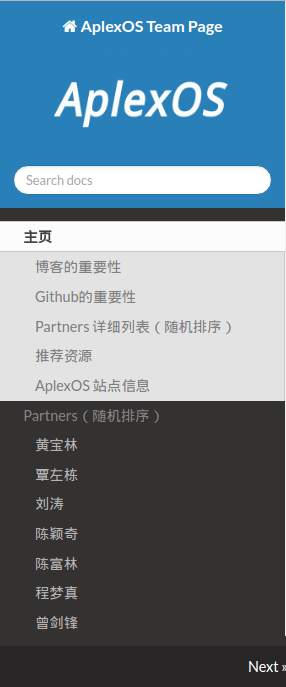

# TeamPage

  * 做为Team成员信息入口，可以通过统一的域名访问大家的博客、Github账户等等相关信息；
  * 网站以Markdown文档开发，经MKDocs处理为静态页面，通过github.io发布；
  * 除了作为一个Team成员信息入口以外，将来可能会考虑加入其他的部分；

## Mkdocs使用方法、安装

  * [参考Mkdocs官方使用说明](http://www.mkdocs.org/)
  * [安装mkdocs](http://www.mkdocs.org/#installation)
    * sudo apt-get install python-pip python-dev build-essential 
    * sudo pip install --upgrade pip 
    * sudo pip install --upgrade virtualenv 
    * sudo pip install pyinotify --upgrade
    * sudo pip install mkdocs

## TeamPage 使用说明

  * Clone这个仓库到本地：
    * cd <打算放置仓库路径>
    * git clone git@github.com:ZengjfOS/TeamPage.git
    * cd TeamPage
  * 查看[autorun.sh](autorun.sh)使用，最好能读懂脚本代码运行流程，目前所有的操作流程都放在了这个脚本中，如下参数说明：
    * server: run as local server;  
      `./autorun.sh server`
    * build: build the mkdocs project to a static web site and it will remove hidden nav items;  
      `./autorun.sh build`
    * pushweb: push the static web site to github.io;  
      `./autorun.sh pushweb`
    * pushpro: push the local mkdocs project to github repository.  
      `./autorun.sh pushpro`
  * 使用autorun.sh执行pushweb、pushpro两个命令时，请修改autorun.sh对应仓库，否则默认提交到本仓库是没有权限的，因为没有允许的你的SSH Key。

## TeamPage md文件导航隐藏方法

目前由于[hidden.py](tools/hidden.py)只能隐藏[mkdocs.yml](mkdocs.yml)文件中pages字段下的hidden导航条目，所以需要隐藏的md文件，写法要符合这种规范，如果又不清楚的地方，请参考本项目的[mkdocs.yml](mkdocs.yml)写法:

```
    [省略内容...]
    pages:
    [省略内容...]
    - hidden :
        - hidden : 'Partners/zengsf/zengsf.md' 
        [这里添加要隐藏的md文件]
    [省略内容...]
```

## TeamPage 添加成员

  * 在docs/Partners/目录添加其自己的子目录，并以Markdown文档写自己的信息；

```
    .
    └── docs
      └── Partners
          ├── chenfl
          │   └── chenfl.md
          ├── chengmz
          │   └── chengmz.md
          ├── chenyq
          │   └── chenyq.md
          ├── liutao
          │   └── liutao.md
          ├── qinzd
          │   └── qinzd.md
          ├── zengjf
          │   └── zengjf.md
          └── zengsf
              └── zengsf.md
```

  * 在docs/index.md中添加引用：

```
    * [覃左栋](Partners/qinzd/qinzd.md)
    * [刘涛](Partners/liutao/liutao.md)
    * [陈颖奇](Partners/chenyq/chenyq.md)
    * [陈富林](Partners/chenfl/chenfl.md)
    * [程梦真](Partners/chengmz/chengmz.md)
    * [曾剑锋](Partners/zengjf/zengjf.md)
```

  * 在mkdocs.yml声明md文件，如果不需要在导航栏中显示，请添加在hidden字段下添加相关md文件：

```
    - hidden :
        - hidden : 'Partners/zengsf/zengsf.md' 
        <以[- hidden : ] 开头、对齐加上md文件相对路径>
```

## 项目搭建中遇到的难题

每个md文件都要mkdocs.yml文件中声明了才能在别的md文件中引用，不然会出现如下错误：

> Error: The page "index.md" contained a hyperlink to "*.md" which is not listed in the "pages" configuration.

如果在mkdocs.yml中的pages中声明，又会出现我们不想要的导航条目，因为并不是所有的md文件都要出现在导航栏中，以下是一份早期的mkdocs.yuml内容如下：

```
    site_favicon: os.ico
    site_name: ZengjfOS
    site_author: zengjf
    pages:
    - 主页 : 'index.md'
    - 推荐资源 :
        - 文章 : 'resource/articles.md'
        - 书籍 : 'resource/books.md'
    - Partners（随机排序）:
        - 覃左栋 : 'Partners/qinzd/qinzd.md'
        - 刘涛 : 'Partners/liutao/liutao.md'
        - 陈颖奇 : 'Partners/chenyq/chenyq.md'
        - 陈富林 : 'Partners/chenfl/chenfl.md'
        - 程梦真 : 'Partners/chengmz/chengmz.md'
        - 曾剑锋 : 'Partners/zengjf/zengjf.md'
    - hidden :
        - hidden : 'Partners/zengsf/zengsf.md' 
    theme: readthedocs
    copyright: 'Copyright © 2016 ZengjfOS'
```

如下是对应的导航栏，注意图片中的hidden相关的导航条目是我们不希望看到的：


于是采用Python3写了一个html自动化处理文档[hidden.py](tools/hidden.py)，处理过程在[autorun.sh](autorun.sh)脚本中:

```shell
    if [ $1 == "build" ];then
        mkdocs build --strict
        for partner in `find * -name *.html`    # 查找所有的html文件
        do
            echo $partner
            ./tools/hidden.py $partner          # 移除需要hidden的导航部分
        done

        exit 0
    fi
```

如下图片中的导航栏是我们希望看到的，也是经过脚本处理后的最终效果：


## readthedocs主题添加站点Logo
  * 修改`/usr/local/lib/python3.4/dist-packages/mkdocs/themes/readthedocs/css/theme.css`文件图片相关的CSS：`.wy-side-nav-search img{display:block;height:45px;width:45px;margin:auto auto 0.809em auto;background-color:#2980B9;padding:5px;border-radius:100%}`为`.wy-side-nav-search img{display:block;height:100px;width:295px;margin:auto auto 0.809em auto;background-color:#2980B9;padding:5px;border-radius:0%`
  * 如果右侧内容显示部分需要自适应宽度，可以修改上面的文件 `.wy-nav-content{padding:1.618em 3.236em;height:100%;max-width: 800px;margin:auto}`为`.wy-nav-content{padding:1.618em 3.236em;height:100%;argin:auto}`
  * 修改`/usr/local/lib/python3.4/dist-packages/mkdocs/themes/readthedocs/base.html`，添加img标签添加图片：
```html
    <div class="wy-side-nav-search">
    
    <a href="{{ nav.homepage.url }}" class="icon icon-home"> {{ config.site_name }}
    </a>
    
    
    
    
    
    </div>
```
  * 在mkdocs.yml中添加logo设置
```
    site_logo: images/os.png
```
  * 图片大小如下：
    * height: 100px;
    * width: 295px;
  * 效果如图：  
    
  * 修改过后的主题：[readthedocs](https://github.com/ZengjfOS/readthedocs)

## Author

[曾剑锋(zengjf)](http://www.cnblogs.com/zengjfgit/)
