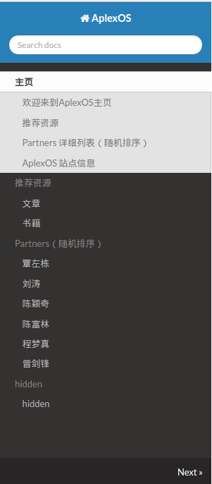

# TeamPage

  * 主要目的是为了使Team成员有一个信息入口，这样每个人可以通过一个统一的域名访问到其他人的博客、Github账户等等相关信息；
  * 网站以Markdown文档开发，经MKDocs处理为静态页面，通过github.io发布，域名为aplexos.com；
  * 每个成员只需要在docs/Partners/目录添加其自己的子目录，并以Markdown文档写自己的信息就可以了；
  * 除了作为一个团队成员信息入口以外，还可以提供一些其他的功能，这些可以后续考虑加入；

# 处理过程中遇到的最大问题

每个md文件都要mkdocs.yml文件中声明了才能在别的md文件中引用，不然会出现如下错误：

    ```
    Error: The page "index.md" contained a hyperlink to "*.md" which is not listed in the "pages" configuration.
    ```

如果在mkdocs.yml中的pages中声明，又会出现我们不想要的导航条目，因为并不是所有的md文件都要出现在导航栏中，mkdocs.yuml内容如下：

    ```
    site_favicon: os.ico
    site_name: AplexOS
    site_author: zengjf
    pages:
    - 主页 : 'index.md'
    - 推荐资源 :
        - 文章 : 'resource/articles.md'
        - 书籍 : 'resource/books.md'
    - Partners（随机排序）:
        - 覃左栋 : 'Partners/qinzd/qinzd.md'
        - 刘涛 : 'Partners/liutao/liutao.md'
        - 陈颖奇 : 'Partners/chenyq/chenyq.md'
        - 陈富林 : 'Partners/chenfl/chenfl.md'
        - 程梦真 : 'Partners/chengmz/chengmz.md'
        - 曾剑锋 : 'Partners/zengjf/zengjf.md'
    - hidden :
        - hidden : 'Partners/zengsf/zengsf.md' 
    theme: readthedocs
    copyright: 'Copyright © 2016 AplexOS'
    ```

如下是对应的UI导航栏，注意图片中的hidden导航条目是我们不希望看到的：

    

于是采用Python3写了一个html自动化处理文档[hidden.py](tools/hidden.py)，处理过程在[autorun.sh](autorun.sh)脚本中:

    ```
    if [ $1 == "build" ];then
        mkdocs build --strict
        for partner in `find * -name *.html`    # 查找所有的html文件
        do
            echo $partner
            ./tools/hidden.py $partner          # 移除需要hidden的导航部分
        done

        exit 0
    fi
    ```
